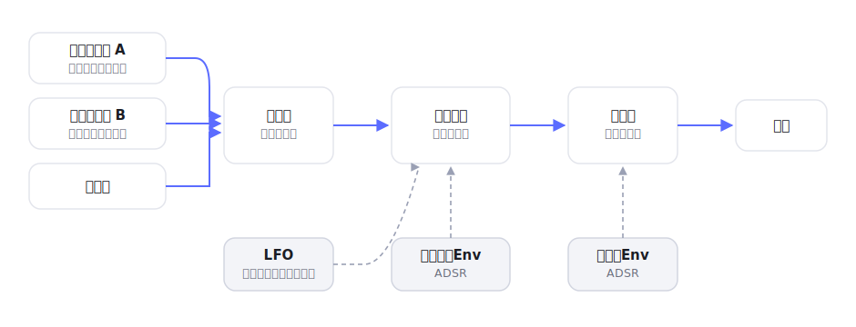

# neiro

[](https://github.com/miruky/neiro/actions/workflows/ci.yml)
[](https://github.com/miruky/neiro/actions/workflows/deploy.yml)

[](LICENSE)

**ブラウザの中だけで音を合成する減算方式のシンセサイザー。**

公開ページ: https://miruky.github.io/neiro/

## 概要

neiroは2基のオシレータ、ノイズ、フィルタ、2つのエンベロープ、LFOを組み合わせて音を作る減算合成シンセサイザーである。各モジュールのつまみを動かすと、合成された波形・フィルタの周波数特性・エンベロープの形が図として即座に描き直され、音がどう変わるかを目で追える。出力は画面上のオシロスコープにも表示される。

画面の鍵盤はマウスやタッチで弾け、パソコンのキーボード(下段 z〜m と上段 q〜u が2オクターブに対応)でも演奏できる。複数の鍵を同時に押す和音にも対応する。作った音色はブラウザのlocalStorageに保存され、次に開いたときに復元される。サーバーへは何も送らない。

Web Audioは利用者の操作を機にしか音を出せないため、最初に鍵盤へ触れるかキーを押した時点で発音が始まる。

### なぜ作ったのか

シンセの仕組みは「オシレータで波形を作り、フィルタで削り、エンベロープで時間変化を与える」という配線で説明される。言葉で読むより、つまみを動かして波形とフィルタ特性が連動して変わるのを見れば早い。インストール不要でその場で触れて、操作と音と図が結びつく学習・試作用のシンセが欲しかった。発音の中身はWeb Audioの標準ノードに任せ、配線の組み立て方そのものを見えるようにしている。

## アーキテクチャ



音を鳴らす部分(`engine.ts`)はAudioContextに依存するため、純粋な計算は分けてある。音名と周波数(`notes.ts`)、波形の標本化(`waveform.ts`)、フィルタの周波数特性(`filterResponse.ts`)、エンベロープの形(`adsr.ts`)、音色データの検証と保存(`patch.ts`)はDOMもWeb Audioも使わない純粋関数で、ブラウザなしでテストする。画面(`app.ts`)はこれらを束ねてエンジンと図へ反映する。

## 技術スタック

| カテゴリ             | 技術                           |
| :------------------- | :----------------------------- |
| 言語                 | TypeScript 5(strict)           |
| 音声                 | Web Audio API                  |
| ビルド               | Vite 6                         |
| テスト               | Vitest                         |
| リンタ・フォーマッタ | ESLint 9 / Prettier            |
| CI / 配信            | GitHub Actions / GitHub Pages  |
| 永続化               | localStorage(外部サービスなし) |

## 使い方

### 演奏する

画面の鍵盤をクリック・タップするか、パソコンのキーボードを押すと音が出る。オクターブの上下ボタンで鍵盤の音域を移動できる。

| 操作           | キー                    |
| :------------- | :---------------------- |
| 下のオクターブ | z s x d c v g b h n j m |
| 上のオクターブ | q 2 w 3 e r 5 t 6 y 7 u |

### 音を作る

各モジュールが信号の流れに沿って並ぶ。

| モジュール            | できること                                                             |
| :-------------------- | :--------------------------------------------------------------------- |
| オシレータ A / B      | 波形(正弦・三角・のこぎり・矩形)、オクターブ移調、デチューン、音量     |
| フィルタ              | 種類(ローパス・ハイパス・バンドパス)、カットオフ、共鳴、エンベロープ量 |
| ノイズ                | ホワイトノイズの混入量                                                 |
| アンプ エンベロープ   | 音量のアタック・ディケイ・サステイン・リリース                         |
| フィルタ エンベロープ | カットオフを時間変化させるADSRと、その効きの向き・量                   |
| LFO                   | 周期的な揺れ。波形・速さ・深さと、音程/フィルタ/音量への行き先         |

プリセットのボタンで、作り込んだ音色から出発できる。

### 図の見方

- **オシレータ波形** — 2基のオシレータを混ぜた1周期。オクターブ差は重なる波数として現れる。
- **出力** — 実際に鳴っている音のオシロスコープ。
- **フィルタ特性** — 横軸を対数の周波数、縦軸を音量(dB)としたフィルタの通し方。共鳴を上げるとカットオフ付近が持ち上がる。

### 制約

- 音が出るにはWeb Audio対応ブラウザでの操作が要る。最初の操作までは無音である。
- フィルタ特性の図はRBJの双二次式による近似で、実際の発音は`BiquadFilterNode`が行う。両者はごく僅かに異なることがある。
- 音色の保存はこの端末のブラウザに限られ、別の端末へは引き継がれない。
- 同時に鳴らせる音数の上限は設けていない。極端に多いと端末の性能に依存して詰まることがある。

## プロジェクト構成

- `index.html` — エントリポイント
- `src/main.ts` — 起動。ストアとエンジンの初期化
- `src/app.ts` — モジュールのつまみ・図・鍵盤の画面
- `src/icons.ts` — 線画SVGアイコン
- `src/style.css` — デザイントークンとスタイル(ライト・ダーク対応)
- `src/lib/engine.ts` — Web Audioによる発音(ボイス管理・エンベロープ・LFO)
- `src/lib/patch.ts` — 音色の型・既定値・プリセット・検証・永続化
- `src/lib/notes.ts` — 音名と周波数、キーボードの対応
- `src/lib/waveform.ts` — 合成波形の標本化とパス化
- `src/lib/filterResponse.ts` — フィルタの周波数特性
- `src/lib/adsr.ts` — エンベロープの形
- `docs/architecture.svg` — 信号の流れ図
- `.github/workflows/` — CI(lint・テスト・ビルド)とPagesデプロイ

## はじめ方

### 前提条件

- Node.js 22以上

### セットアップ

```bash
git clone https://github.com/miruky/neiro.git
cd neiro
npm install
npm run dev
```

### テストの実行

```bash
npm test
```

### Lintの実行

```bash
npm run lint
```

### ビルド

```bash
npm run build
```

GitHub Pagesではリポジトリ名のサブパスで配信されるため、デプロイ時は環境変数 `NEIRO_BASE=/neiro/` でViteの `base` を切り替える(`.github/workflows/deploy.yml` 参照)。

## 設計方針

- **発音と計算を分ける** — AudioContextに触れるのは`engine.ts`だけにし、音名・波形・フィルタ特性・エンベロープといった規則は純粋関数へ切り出す。これで音を鳴らさずに中身をテストでき、図も同じ計算から描ける。
- **操作・音・図を連動させる** — つまみを動かすと、音のエンジンと3つの図が同じパッチから更新される。配線の効きが目と耳の両方で確かめられる。
- **標準ノードに任せる** — オシレータ・フィルタ・ゲインはWeb Audioのノードをそのまま組む。自前のDSPを書かず、配線の設計に集中する。
- **状態は1つ** — 音色は単一のパッチオブジェクトに集約し、保存・復元・プリセット適用をその差し替えだけで扱う。

## ライセンス

[MIT](LICENSE)
